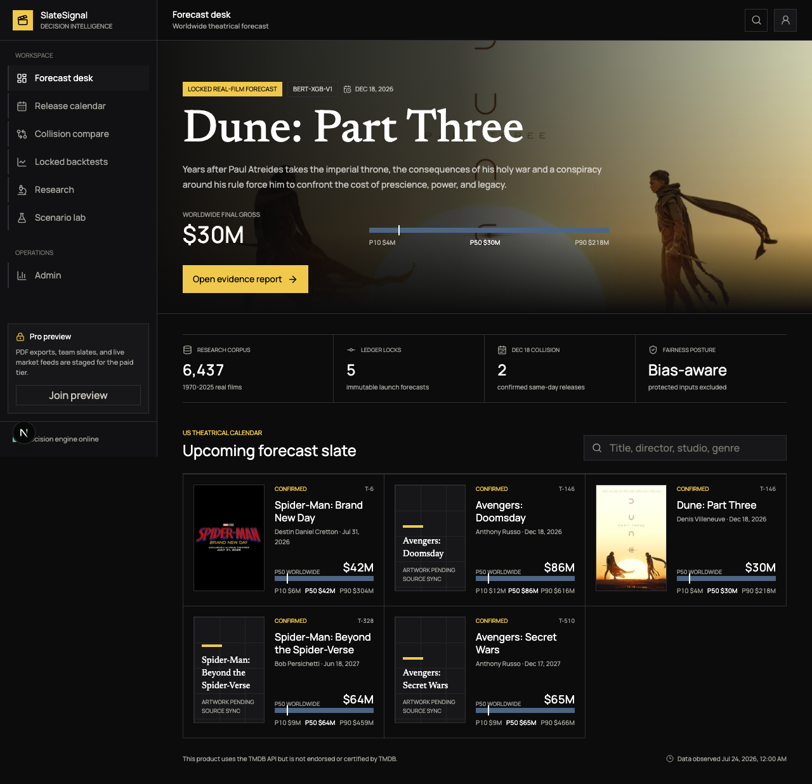
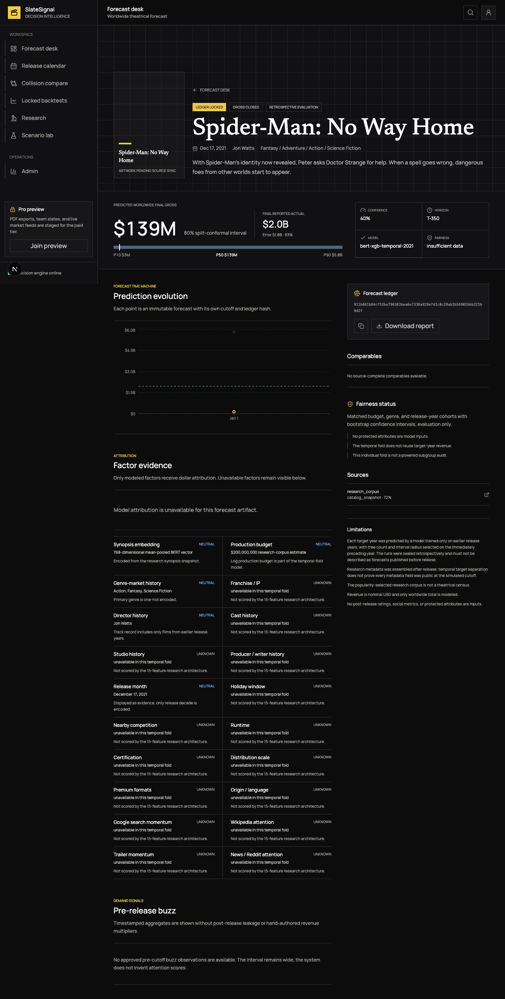
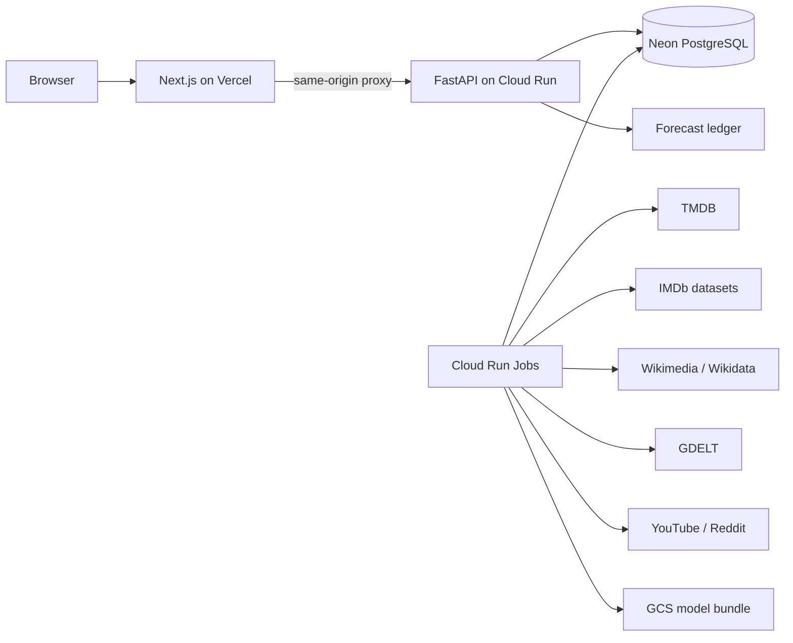

# SlateSignal

**Bias-Aware Financial Success Prediction for Film Productions Using Multi-Modal NLP**

SlateSignal is a public forecasting ledger for real US theatrical releases. It
combines a mean-pooled 768-dimensional BERT synopsis representation, structured
film history, release context, and time-stamped demand evidence to estimate
worldwide box office as an uncertainty interval.

The product's differentiator is its **Forecast Time Machine**. Every official
forecast is sealed with its model version, data cutoff, feature manifest,
source timestamps, P10/P50/P90 outputs, and a SHA-256 hash chain. Actual grosses
are appended later; the original prediction is never rewritten.

> Forecasts are estimates, not investment advice. SlateSignal is bias-aware,
> not claimed to be perfectly unbiased.

## Product Surfaces

- `/` is the real upcoming-film forecast desk.
- `/movies/[slug]` is a source-level evidence report and forecast history.
- `/calendar` covers confirmed and tentative US theatrical release records.
- `/compare` analyzes overlapping release windows.
- `/backtests` separates retrospective evaluations from genuine pre-release locks.
- `/research` presents the 6,437-film study and honest model tournament.
- `/lab` is a separate counterfactual workspace for user-created concepts.

There are no fictional catalog entries or generated fictional posters. A fresh
checkout starts with a source-backed snapshot of 504 released films from
2021-2025 and five officially announced upcoming films. The credentialed TMDB
job expands this to the full configured US theatrical window from 2021-2030.
All 504 released research films have sealed predicted-versus-actual evaluation
records: 480 year-by-year temporal folds for 2021-2024 and the 24-film closed
2025 holdout. These are labeled retrospective; only the five launch forecasts
are presented as genuine pre-release locks.

## Product Preview





## Research and Models

`bert-xgb-v1` preserves the original research contract:

- `bert-base-uncased`
- attention-mask-aware mean pooling
- 768 synopsis dimensions
- 15 original structured features
- XGBoost over 783 total features
- worldwide nominal USD target

The original reported result was $115.03M MAE and R2 0.382. The reconstructed
untouched 2024 validation produced $111.15M MAE, log-MAE 1.4375, and 79.34%
coverage for the nominal 80% interval.

The corrected `multimodal-xgb-v2` candidate uses time-frozen talent and studio
history, CPI-normalized targets, and an internal temporal tuning split. It
improved 2024 MAE to $104.22M and the 2025 holdout MAE to $112.40M, but it was
not promoted because holdout interval coverage and fairness-evidence gates did
not all pass. Failed promotion is a product result, not hidden metadata.

The CPU encoder is exported as FP16 ONNX with FP32 I/O. Its checked parity
report records cosine similarity above 0.999999, embedding RMSE below 0.00047,
and zero downstream XGBoost prediction drift on the validation samples.

For released-film exploration, `bert-xgb-temporal-2021` through
`bert-xgb-temporal-2024` train only on earlier years and calibrate on the
immediately preceding year. They are leakage-labeled evaluation folds, not
promotion candidates or reconstructed publication claims.

## Architecture



Every source observation stores `source`, `observed_at`, `source_url`,
`confidence`, and a raw-response checksum. Strict forecast features are limited
to records observed on or before the forecast cutoff. Competing actual-gross
claims remain visible instead of being silently merged.

## Local Development

Requirements: Node.js 22+, Python 3.13, npm, and optionally Docker.

```bash
make bootstrap
cp .env.example .env
```

Run the API and web app in separate terminals:

```bash
make dev-api
make dev-web
```

Open `http://localhost:3000`; OpenAPI is at `http://localhost:8000/docs`.
No credential is needed for the portable launch snapshot. Add a fresh
`TMDB_API_TOKEN` before running the exhaustive sync:

```bash
cd services/inference
.venv/bin/python -m slatesignal.cli catalog-sync
.venv/bin/python -m slatesignal.cli imdb-sync
.venv/bin/python -m slatesignal.cli actuals-sync
.venv/bin/python -m slatesignal.cli buzz-sync
.venv/bin/python -m slatesignal.cli forecast-snapshot
```

The old notebook credentials must be considered revoked. Secrets are accepted
only through local environment files or a production secret manager.

## Quality Gates

```bash
make check
make build
cd apps/web && npm run test:e2e
```

- 33 backend tests with at least 80% application/model coverage
- strict mypy and Ruff
- 15 Vitest checks with about 90% frontend unit coverage
- Playwright journeys on desktop and mobile
- frozen feature-vector and XGBoost golden replay
- ONNX embedding and downstream parity gates
- leakage, idempotency, conflict, ledger, auth, and API contract tests
- Alembic migration verification, CodeQL, dependency audits, and secret scan

## Repository

```text
apps/web/                  Next.js product interface
services/inference/        FastAPI API, model runtime, jobs, and migrations
services/inference/data/   Portable source-backed bootstrap artifacts
services/inference/artifacts/ Versioned model contracts and small artifacts
scripts/                   Reproducible extraction, training, export, and policy jobs
infra/                     GCP, DigitalOcean, and AWS deployment definitions
docs/                      Architecture, model card, deployment, and threat model
```

Exploratory notebooks are intentionally absent. Their reusable logic lives in
importable Python packages and tested CLI jobs. The 208 MB ONNX binary is
excluded from Git and mounted from GCS in production; its checksum is versioned.

## Deployment

The recommended resume deployment is Vercel + GCP Cloud Run + Cloud Run Jobs +
Cloud Scheduler + Neon PostgreSQL + GCS. Railway, DigitalOcean, Heroku, and AWS
can use the same non-root containers. See [Deployment](docs/DEPLOYMENT.md).

## License

[MIT](LICENSE)
